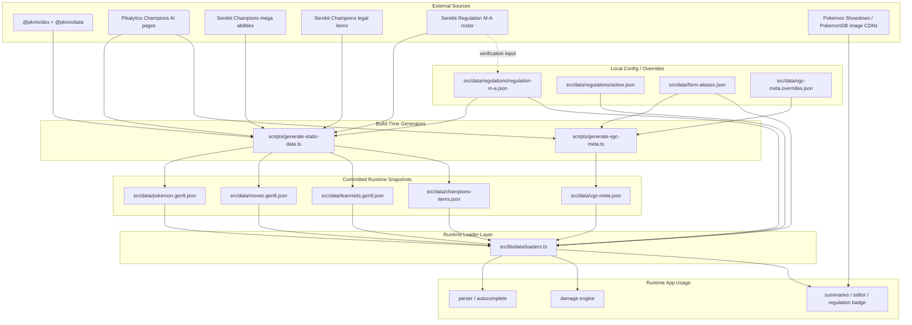

# Omniboost Data Sources

This doc list every data source Omniboost use, what each source own, where app consume it.

## Source-Of-Truth Diagram

## Source-Of-Truth Policy

- Canonical species, moves, learnsets come from `@pkmn/dex` and `@pkmn/data`
- Competitive Champions defaults come from Pikalytics, then normalize into `src/data/vgc-meta.json`
- Champions mega ability gaps get patched from Serebii during generation
- Legal Champions items come from Serebii, then snapshot into `src/data/champions-items.json`
- Regulation legality stay local in `src/data/regulations/regulation-m-a.json`
- Runtime gameplay logic no fetch live meta data. Runtime read committed JSON snapshots through `src/lib/data/loaders.ts`
- Runtime network fetch only for Pokemon images in summary UI

## External Sources

### 1. `@pkmn/dex` and `@pkmn/data`

Purpose:

- canonical Pokemon species data
- canonical move data
- canonical learnsets

Used in:

- [scripts/generate-static-data.ts](C:\Users\leand\Documents\GitHub\omniboost\scripts\generate-static-data.ts)

Outputs:

- [src/data/pokemon.gen9.json](C:\Users\leand\Documents\GitHub\omniboost\src\data\pokemon.gen9.json)
- [src/data/moves.gen9.json](C:\Users\leand\Documents\GitHub\omniboost\src\data\moves.gen9.json)
- [src/data/learnsets.gen9.json](C:\Users\leand\Documents\GitHub\omniboost\src\data\learnsets.gen9.json)

Why:

- base structural dataset for species, forms, stats, moves, learnsets

### 2. Pikalytics Champions AI pages

Source:

- `https://www.pikalytics.com/ai/pokedex/championspreview`
- per-Pokemon AI pages under same route

Purpose:

- current Champions metagame usage
- common moves
- common abilities
- common items
- default move / ability / item derivation
- current Champions species roster as enrichment input for generation

Used in:

- [scripts/generate-vgc-meta.ts](C:\Users\leand\Documents\GitHub\omniboost\scripts\generate-vgc-meta.ts)
- [scripts/generate-static-data.ts](C:\Users\leand\Documents\GitHub\omniboost\scripts\generate-static-data.ts)

Outputs:

- [src/data/vgc-meta.json](C:\Users\leand\Documents\GitHub\omniboost\src\data\vgc-meta.json)
- extra Champions species coverage in [src/data/pokemon.gen9.json](C:\Users\leand\Documents\GitHub\omniboost\src\data\pokemon.gen9.json)

Why:

- Omniboost need competitive meta layer on top of structural Dex data

### 3. Serebii Champions mega abilities

Source:

- `https://www.serebii.net/pokemonchampions/megaabilities.shtml`

Purpose:

- patch Champions mega form abilities when other sources incomplete

Used in:

- [scripts/generate-static-data.ts](C:\Users\leand\Documents\GitHub\omniboost\scripts\generate-static-data.ts)

Outputs affected:

- [src/data/pokemon.gen9.json](C:\Users\leand\Documents\GitHub\omniboost\src\data\pokemon.gen9.json)

Why:

- some Champions mega abilities missing or incomplete elsewhere

### 4. Serebii Champions legal items

Source:

- `https://www.serebii.net/pokemonchampions/items.shtml`

Purpose:

- authoritative legal held-item pool for Pokemon Champions
- exclude `Miscellaneous Items` section

Used in:

- [scripts/generate-static-data.ts](C:\Users\leand\Documents\GitHub\omniboost\scripts\generate-static-data.ts)

Outputs affected:

- [src/data/champions-items.json](C:\Users\leand\Documents\GitHub\omniboost\src\data\champions-items.json)
- indirect legal-item constraint for [src/data/vgc-meta.json](C:\Users\leand\Documents\GitHub\omniboost\src\data\vgc-meta.json)

Why:

- meta-derived item pools incomplete; can miss legal items like type boosters and resist berries

### 5. Serebii Champions Regulation M-A roster

Source:

- `https://www.serebii.net/pokemonchampions/recruit/regularrosterm-a.shtml`

Purpose:

- live verification input for local legality roster

Used in:

- [scripts/generate-static-data.ts](C:\Users\leand\Documents\GitHub\omniboost\scripts\generate-static-data.ts)
- compared against [src/data/regulations/regulation-m-a.json](C:\Users\leand\Documents\GitHub\omniboost\src\data\regulations\regulation-m-a.json)

Why:

- legal but low-usage species can disappear from pure meta-driven pipelines
- generation script verify local roster against live Serebii page and update `active.json` verification metadata when match happens

### 6. Runtime image CDNs

Sources:

- `https://play.pokemonshowdown.com/sprites/home/...`
- `https://play.pokemonshowdown.com/sprites/dex/...`
- `https://play.pokemonshowdown.com/sprites/gen5/...`
- `https://img.pokemondb.net/sprites/home/normal/...`
- `https://img.pokemondb.net/artwork/large/...`

Purpose:

- sprite / artwork rendering in Pokemon side summaries

Used in:

- [src/components/omnibar/pokemon-side-summary.tsx](C:\Users\leand\Documents\GitHub\omniboost\src\components\omnibar\pokemon-side-summary.tsx)

Why:

- repo no store image assets locally

## Local Config And Snapshot Files

### 7. `src/data/regulations/active.json`

Purpose:

- choose active regulation at runtime

Used in:

- [src/lib/data/loaders.ts](C:\Users\leand\Documents\GitHub\omniboost\src\lib\data\loaders.ts)

Effects:

- choose active regulation entry at runtime
- affect regulation badge and legal Pokemon filtering

### 8. `src/data/regulations/regulation-m-a.json`

Purpose:

- authoritative local legality list for Regulation M-A

Used in:

- [src/lib/data/loaders.ts](C:\Users\leand\Documents\GitHub\omniboost\src\lib\data\loaders.ts)
- [scripts/generate-static-data.ts](C:\Users\leand\Documents\GitHub\omniboost\scripts\generate-static-data.ts)

Effects:

- build `legalPokemonData` at runtime
- force all legal M-A species into generated dataset, even outside top meta slice

### 9. `src/data/form-aliases.json`

Purpose:

- explicit alias and form resolution

Used in:

- [src/lib/data/loaders.ts](C:\Users\leand\Documents\GitHub\omniboost\src\lib\data\loaders.ts)
- [src/lib/parser/fuse-indexes.ts](C:\Users\leand\Documents\GitHub\omniboost\src\lib\parser\fuse-indexes.ts)
- [src/lib/parser/showdown-import.ts](C:\Users\leand\Documents\GitHub\omniboost\src\lib\parser\showdown-import.ts)
- [scripts/generate-vgc-meta.ts](C:\Users\leand\Documents\GitHub\omniboost\scripts\generate-vgc-meta.ts)

### 10. `src/data/vgc-meta.overrides.json`

Purpose:

- local overrides for generated competitive profiles

Used in:

- [scripts/generate-vgc-meta.ts](C:\Users\leand\Documents\GitHub\omniboost\scripts\generate-vgc-meta.ts)

Effects:

- can override generated defaults, limits, species mappings, profile fields

## Generated Runtime Snapshots

These files = runtime gameplay source of truth.

### 11. `src/data/pokemon.gen9.json`

Purpose:

- resolved Pokemon entries for runtime app

Loaded in:

- [src/lib/data/loaders.ts](C:\Users\leand\Documents\GitHub\omniboost\src\lib\data\loaders.ts)

Consumed by:

- [src/lib/calc/damage-engine.ts](C:\Users\leand\Documents\GitHub\omniboost\src\lib\calc\damage-engine.ts)
- [src/lib/parser/fuse-indexes.ts](C:\Users\leand\Documents\GitHub\omniboost\src\lib\parser\fuse-indexes.ts)
- [src/lib/parser/command-parser.ts](C:\Users\leand\Documents\GitHub\omniboost\src\lib\parser\command-parser.ts)
- [src/lib/parser/inference.ts](C:\Users\leand\Documents\GitHub\omniboost\src\lib\parser\inference.ts)
- [src/lib/parser/showdown-import.ts](C:\Users\leand\Documents\GitHub\omniboost\src\lib\parser\showdown-import.ts)
- [src/store/use-omni-store.ts](C:\Users\leand\Documents\GitHub\omniboost\src\store\use-omni-store.ts)
- [src/components/omnibar/pokemon-set-editor-modal.tsx](C:\Users\leand\Documents\GitHub\omniboost\src\components\omnibar\pokemon-set-editor-modal.tsx)
- [src/components/omnibar/pokemon-side-summary.tsx](C:\Users\leand\Documents\GitHub\omniboost\src\components\omnibar\pokemon-side-summary.tsx)

### 12. `src/data/moves.gen9.json`

Purpose:

- resolved move entries for runtime parsing and damage calc

Loaded in:

- [src/lib/data/loaders.ts](C:\Users\leand\Documents\GitHub\omniboost\src\lib\data\loaders.ts)

Consumed by:

- [src/lib/calc/damage-engine.ts](C:\Users\leand\Documents\GitHub\omniboost\src\lib\calc\damage-engine.ts)
- [src/lib/parser/command-parser.ts](C:\Users\leand\Documents\GitHub\omniboost\src\lib\parser\command-parser.ts)
- [src/lib/parser/inference.ts](C:\Users\leand\Documents\GitHub\omniboost\src\lib\parser\inference.ts)
- [src/components/omnibar/pokemon-set-editor-modal.tsx](C:\Users\leand\Documents\GitHub\omniboost\src\components\omnibar\pokemon-set-editor-modal.tsx)
- [src/components/omnibar/pokemon-side-summary.tsx](C:\Users\leand\Documents\GitHub\omniboost\src\components\omnibar\pokemon-side-summary.tsx)

### 13. `src/data/learnsets.gen9.json`

Purpose:

- legal move pools for fallback inference and set editing

Loaded in:

- [src/lib/data/loaders.ts](C:\Users\leand\Documents\GitHub\omniboost\src\lib\data\loaders.ts)

Consumed by:

- [src/lib/parser/inference.ts](C:\Users\leand\Documents\GitHub\omniboost\src\lib\parser\inference.ts)
- [src/components/omnibar/pokemon-set-editor-modal.tsx](C:\Users\leand\Documents\GitHub\omniboost\src\components\omnibar\pokemon-set-editor-modal.tsx)

### 14. `src/data/champions-items.json`

Purpose:

- legal held-item snapshot for Pokemon Champions

Loaded in:

- [src/lib/data/loaders.ts](C:\Users\leand\Documents\GitHub\omniboost\src\lib\data\loaders.ts)

Consumed by:

- [src/lib/parser/command-parser.ts](C:\Users\leand\Documents\GitHub\omniboost\src\lib\parser\command-parser.ts)
- [src/lib/parser/inference.ts](C:\Users\leand\Documents\GitHub\omniboost\src\lib\parser\inference.ts)
- [src/components/omnibar/pokemon-set-editor-modal.tsx](C:\Users\leand\Documents\GitHub\omniboost\src\components\omnibar\pokemon-set-editor-modal.tsx)
- [src/components/omnibar/pokemon-side-summary.tsx](C:\Users\leand\Documents\GitHub\omniboost\src\components\omnibar\pokemon-side-summary.tsx)

### 15. `src/data/vgc-meta.json`

Purpose:

- normalized competitive defaults and suggestion pools for active Champions meta

Loaded in:

- [src/lib/data/loaders.ts](C:\Users\leand\Documents\GitHub\omniboost\src\lib\data\loaders.ts)

Consumed by:

- [src/lib/parser/command-parser.ts](C:\Users\leand\Documents\GitHub\omniboost\src\lib\parser\command-parser.ts)
- [src/lib/parser/inference.ts](C:\Users\leand\Documents\GitHub\omniboost\src\lib\parser\inference.ts)
- [src/store/use-omni-store.ts](C:\Users\leand\Documents\GitHub\omniboost\src\store\use-omni-store.ts)
- [src/components/omnibar/pokemon-set-editor-modal.tsx](C:\Users\leand\Documents\GitHub\omniboost\src\components\omnibar\pokemon-set-editor-modal.tsx)

## Runtime Loader Layer

### 16. `src/lib/data/loaders.ts`

This file = runtime aggregation point for local data.

It loads:

- `pokemon.gen9.json`
- `moves.gen9.json`
- `learnsets.gen9.json`
- `champions-items.json`
- `vgc-meta.json`
- `form-aliases.json`
- `active.json`
- `regulation-m-a.json`

It builds and exports:

- `pokemonById`
- `moveById`
- `learnsetByPokemonId`
- `vgcMetaByPokemonId`
- `formAliasMap`
- `legalPokemonData`
- `allowedItemIds`
- `itemDisplayById`
- `activeRegulation`
- `resolveMegaEvolution()`

This file = effective runtime source-of-truth layer for app code.

## Practical Data Flow

### Build time

1. [scripts/generate-static-data.ts](C:\Users\leand\Documents\GitHub\omniboost\scripts\generate-static-data.ts) pull structural species/move/learnset data and write local JSON snapshots
2. [scripts/generate-vgc-meta.ts](C:\Users\leand\Documents\GitHub\omniboost\scripts\generate-vgc-meta.ts) pull Champions usage/meta data and write `vgc-meta.json`
3. Generated files get committed under `src/data/`

### Runtime

1. [src/lib/data/loaders.ts](C:\Users\leand\Documents\GitHub\omniboost\src\lib\data\loaders.ts) load committed JSON snapshots
2. Parser, autocomplete, calc, UI consume in-memory maps
3. No live meta/gameplay fetch during normal app usage
4. Images = only runtime network dependency

## Important Constraint

App look stale or miss legal species. First place to inspect not runtime code. Inspect one of these:

- [scripts/generate-static-data.ts](C:\Users\leand\Documents\GitHub\omniboost\scripts\generate-static-data.ts)
- [scripts/generate-vgc-meta.ts](C:\Users\leand\Documents\GitHub\omniboost\scripts\generate-vgc-meta.ts)
- [src/data/regulations/regulation-m-a.json](C:\Users\leand\Documents\GitHub\omniboost\src\data\regulations\regulation-m-a.json)
- [src/data/vgc-meta.overrides.json](C:\Users\leand\Documents\GitHub\omniboost\src\data\vgc-meta.overrides.json)

Source accuracy decided there.
