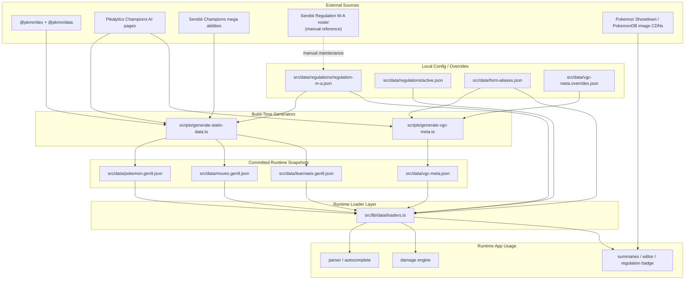

# Omniboost Data Sources

This document lists every data source used by Omniboost, what each source is responsible for, and where that data is consumed in the codebase.

## Source Of Truth Diagram

## Source Of Truth Policy

- Canonical species, moves, and learnsets come from `@pkmn/dex` and `@pkmn/data`.
- Competitive Champions meta defaults come from Pikalytics snapshots, then get normalized into `src/data/vgc-meta.json`.
- Champions mega ability gaps are patched from Serebii during generation.
- Regulation legality is controlled locally in `src/data/regulations/regulation-m-a.json`.
- Runtime gameplay logic does not fetch live meta data. It reads committed JSON snapshots through `src/lib/data/loaders.ts`.
- Runtime network requests are only used for Pokemon images in the summary UI.

## External Sources

### 1. `@pkmn/dex` and `@pkmn/data`

Purpose:
- canonical Pokemon species data
- canonical move data
- canonical learnsets

Used in:
- [scripts/generate-static-data.ts](C:\Users\leand\Documents\GitHub\omniboost\scripts\generate-static-data.ts)

Outputs generated from it:
- [src/data/pokemon.gen9.json](C:\Users\leand\Documents\GitHub\omniboost\src\data\pokemon.gen9.json)
- [src/data/moves.gen9.json](C:\Users\leand\Documents\GitHub\omniboost\src\data\moves.gen9.json)
- [src/data/learnsets.gen9.json](C:\Users\leand\Documents\GitHub\omniboost\src\data\learnsets.gen9.json)

Why it exists:
- this is the base structural dataset for species, forms, stats, moves, and learnsets

### 2. Pikalytics Champions AI pages

Source:
- `https://www.pikalytics.com/ai/pokedex/championspreview`
- per-Pokemon AI pages under the same route

Purpose:
- current Champions metagame usage
- common moves
- common abilities
- common items
- default move / default ability / default item derivation
- current Champions species roster used as an enrichment input for generation

Used in:
- [scripts/generate-vgc-meta.ts](C:\Users\leand\Documents\GitHub\omniboost\scripts\generate-vgc-meta.ts)
- [scripts/generate-static-data.ts](C:\Users\leand\Documents\GitHub\omniboost\scripts\generate-static-data.ts)

Outputs generated from it:
- [src/data/vgc-meta.json](C:\Users\leand\Documents\GitHub\omniboost\src\data\vgc-meta.json)
- contributes additional Champions species coverage to [src/data/pokemon.gen9.json](C:\Users\leand\Documents\GitHub\omniboost\src\data\pokemon.gen9.json)

Why it exists:
- Omniboost needs a competitive meta layer on top of the structural Dex data

### 3. Serebii Champions mega abilities

Source:
- `https://www.serebii.net/pokemonchampions/megaabilities.shtml`

Purpose:
- patch Champions mega form abilities when other sources are incomplete or missing

Used in:
- [scripts/generate-static-data.ts](C:\Users\leand\Documents\GitHub\omniboost\scripts\generate-static-data.ts)

Outputs affected:
- [src/data/pokemon.gen9.json](C:\Users\leand\Documents\GitHub\omniboost\src\data\pokemon.gen9.json)

Why it exists:
- some Champions mega abilities were not complete in other accessible sources

### 4. Serebii Champions Regulation M-A roster

Source:
- `https://www.serebii.net/pokemonchampions/recruit/regularrosterm-a.shtml`

Purpose:
- manual reference for keeping the local legality roster accurate

Used in:
- not fetched at runtime
- used as the reference when maintaining [src/data/regulations/regulation-m-a.json](C:\Users\leand\Documents\GitHub\omniboost\src\data\regulations\regulation-m-a.json)

Why it exists:
- legal-but-low-usage species can be missing from pure meta-driven pipelines, so legality is maintained locally

### 5. Runtime image CDNs

Sources:
- `https://play.pokemonshowdown.com/sprites/home/...`
- `https://play.pokemonshowdown.com/sprites/dex/...`
- `https://play.pokemonshowdown.com/sprites/gen5/...`
- `https://img.pokemondb.net/sprites/home/normal/...`
- `https://img.pokemondb.net/artwork/large/...`

Purpose:
- sprite / artwork rendering in the Pokemon side summaries

Used in:
- [src/components/omnibar/pokemon-side-summary.tsx](C:\Users\leand\Documents\GitHub\omniboost\src\components\omnibar\pokemon-side-summary.tsx)

Why it exists:
- image assets are not stored locally in the repo

## Local Config And Snapshot Files

### 6. `src/data/regulations/active.json`

Purpose:
- selects the active regulation used by the app

Used in:
- [src/lib/data/loaders.ts](C:\Users\leand\Documents\GitHub\omniboost\src\lib\data\loaders.ts)

Effects:
- controls which regulation entry becomes active at runtime
- affects the regulation badge and legal Pokemon filtering

### 7. `src/data/regulations/regulation-m-a.json`

Purpose:
- authoritative local legality list for Regulation M-A

Used in:
- [src/lib/data/loaders.ts](C:\Users\leand\Documents\GitHub\omniboost\src\lib\data\loaders.ts)
- [scripts/generate-static-data.ts](C:\Users\leand\Documents\GitHub\omniboost\scripts\generate-static-data.ts)

Effects:
- builds `legalPokemonData` at runtime
- forces all legal M-A species into the generated dataset, even if they are outside the top meta slice

### 8. `src/data/form-aliases.json`

Purpose:
- explicit alias and form resolution

Used in:
- [src/lib/data/loaders.ts](C:\Users\leand\Documents\GitHub\omniboost\src\lib\data\loaders.ts)
- [src/lib/parser/fuse-indexes.ts](C:\Users\leand\Documents\GitHub\omniboost\src\lib\parser\fuse-indexes.ts)
- [src/lib/parser/showdown-import.ts](C:\Users\leand\Documents\GitHub\omniboost\src\lib\parser\showdown-import.ts)
- [scripts/generate-vgc-meta.ts](C:\Users\leand\Documents\GitHub\omniboost\scripts\generate-vgc-meta.ts)

### 9. `src/data/vgc-meta.overrides.json`

Purpose:
- local overrides for generated competitive profiles

Used in:
- [scripts/generate-vgc-meta.ts](C:\Users\leand\Documents\GitHub\omniboost\scripts\generate-vgc-meta.ts)

Effects:
- can override generated defaults, limits, species mappings, and profile fields

## Generated Runtime Snapshots

These are the repo’s runtime gameplay data source of truth.

### 10. `src/data/pokemon.gen9.json`

Purpose:
- resolved Pokemon entries used by the runtime app

Loaded in:
- [src/lib/data/loaders.ts](C:\Users\leand\Documents\GitHub\omniboost\src\lib\data\loaders.ts)

Consumed by:
- [src/lib/calc/damage-engine.ts](C:\Users\leand\Documents\GitHub\omniboost\src\lib\calc\damage-engine.ts)
- [src/lib/parser/fuse-indexes.ts](C:\Users\leand\Documents\GitHub\omniboost\src\lib\parser\fuse-indexes.ts)
- [src/lib/parser/command-parser.ts](C:\Users\leand\Documents\GitHub\omniboost\src\lib\parser\command-parser.ts)
- [src/lib/parser/inference.ts](C:\Users\leand\Documents\GitHub\omniboost\src\lib\parser\inference.ts)
- [src/lib/parser/showdown-import.ts](C:\Users\leand\Documents\GitHub\omniboost\src\lib\parser\showdown-import.ts)
- [src/store/use-omni-store.ts](C:\Users\leand\Documents\GitHub\omniboost\src\store\use-omni-store.ts)
- [src/components/omnibar/pokemon-set-editor-modal.tsx](C:\Users\leand\Documents\GitHub\omniboost\src\components\omnibar\pokemon-set-editor-modal.tsx)
- [src/components/omnibar/pokemon-side-summary.tsx](C:\Users\leand\Documents\GitHub\omniboost\src\components\omnibar\pokemon-side-summary.tsx)

### 11. `src/data/moves.gen9.json`

Purpose:
- resolved move entries used by runtime parsing and damage calculation

Loaded in:
- [src/lib/data/loaders.ts](C:\Users\leand\Documents\GitHub\omniboost\src\lib\data\loaders.ts)

Consumed by:
- [src/lib/calc/damage-engine.ts](C:\Users\leand\Documents\GitHub\omniboost\src\lib\calc\damage-engine.ts)
- [src/lib/parser/command-parser.ts](C:\Users\leand\Documents\GitHub\omniboost\src\lib\parser\command-parser.ts)
- [src/lib/parser/inference.ts](C:\Users\leand\Documents\GitHub\omniboost\src\lib\parser\inference.ts)
- [src/components/omnibar/pokemon-set-editor-modal.tsx](C:\Users\leand\Documents\GitHub\omniboost\src\components\omnibar\pokemon-set-editor-modal.tsx)
- [src/components/omnibar/pokemon-side-summary.tsx](C:\Users\leand\Documents\GitHub\omniboost\src\components\omnibar\pokemon-side-summary.tsx)

### 12. `src/data/learnsets.gen9.json`

Purpose:
- legal move pools for fallback inference and set editing

Loaded in:
- [src/lib/data/loaders.ts](C:\Users\leand\Documents\GitHub\omniboost\src\lib\data\loaders.ts)

Consumed by:
- [src/lib/parser/inference.ts](C:\Users\leand\Documents\GitHub\omniboost\src\lib\parser\inference.ts)
- [src/components/omnibar/pokemon-set-editor-modal.tsx](C:\Users\leand\Documents\GitHub\omniboost\src\components\omnibar\pokemon-set-editor-modal.tsx)

### 13. `src/data/vgc-meta.json`

Purpose:
- normalized competitive defaults and suggestion pools for the active Champions meta

Loaded in:
- [src/lib/data/loaders.ts](C:\Users\leand\Documents\GitHub\omniboost\src\lib\data\loaders.ts)

Consumed by:
- [src/lib/parser/command-parser.ts](C:\Users\leand\Documents\GitHub\omniboost\src\lib\parser\command-parser.ts)
- [src/lib/parser/inference.ts](C:\Users\leand\Documents\GitHub\omniboost\src\lib\parser\inference.ts)
- [src/store/use-omni-store.ts](C:\Users\leand\Documents\GitHub\omniboost\src\store\use-omni-store.ts)
- [src/components/omnibar/pokemon-set-editor-modal.tsx](C:\Users\leand\Documents\GitHub\omniboost\src\components\omnibar\pokemon-set-editor-modal.tsx)

## Runtime Loader Layer

### 14. `src/lib/data/loaders.ts`

This is the runtime aggregation point for local data.

It loads:
- `pokemon.gen9.json`
- `moves.gen9.json`
- `learnsets.gen9.json`
- `vgc-meta.json`
- `form-aliases.json`
- `active.json`
- `regulation-m-a.json`

It builds and exports:
- `pokemonById`
- `moveById`
- `learnsetByPokemonId`
- `vgcMetaByPokemonId`
- `formAliasMap`
- `legalPokemonData`
- `allowedItemIds`
- `itemDisplayById`
- `activeRegulation`
- `resolveMegaEvolution()`
- sprite slug helpers

This file is the effective runtime source-of-truth layer for app code.

## Practical Data Flow

### Build time

1. [scripts/generate-static-data.ts](C:\Users\leand\Documents\GitHub\omniboost\scripts\generate-static-data.ts) pulls structural species/move/learnset data and writes local JSON snapshots.
2. [scripts/generate-vgc-meta.ts](C:\Users\leand\Documents\GitHub\omniboost\scripts\generate-vgc-meta.ts) pulls Champions usage/meta data and writes `vgc-meta.json`.
3. Those generated files are committed under `src/data/`.

### Runtime

1. [src/lib/data/loaders.ts](C:\Users\leand\Documents\GitHub\omniboost\src\lib\data\loaders.ts) loads the committed JSON snapshots.
2. Parser, autocomplete, calc, and UI all consume those in-memory maps.
3. No live meta/gameplay fetch happens during normal app usage.
4. Images are the only runtime network dependency.

## Important Constraint

If the app seems to have stale meta or missing legal species, the first place to inspect is not runtime code. It is one of:

- [scripts/generate-static-data.ts](C:\Users\leand\Documents\GitHub\omniboost\scripts\generate-static-data.ts)
- [scripts/generate-vgc-meta.ts](C:\Users\leand\Documents\GitHub\omniboost\scripts\generate-vgc-meta.ts)
- [src/data/regulations/regulation-m-a.json](C:\Users\leand\Documents\GitHub\omniboost\src\data\regulations\regulation-m-a.json)
- [src/data/vgc-meta.overrides.json](C:\Users\leand\Documents\GitHub\omniboost\src\data\vgc-meta.overrides.json)

That is where source accuracy is determined.
